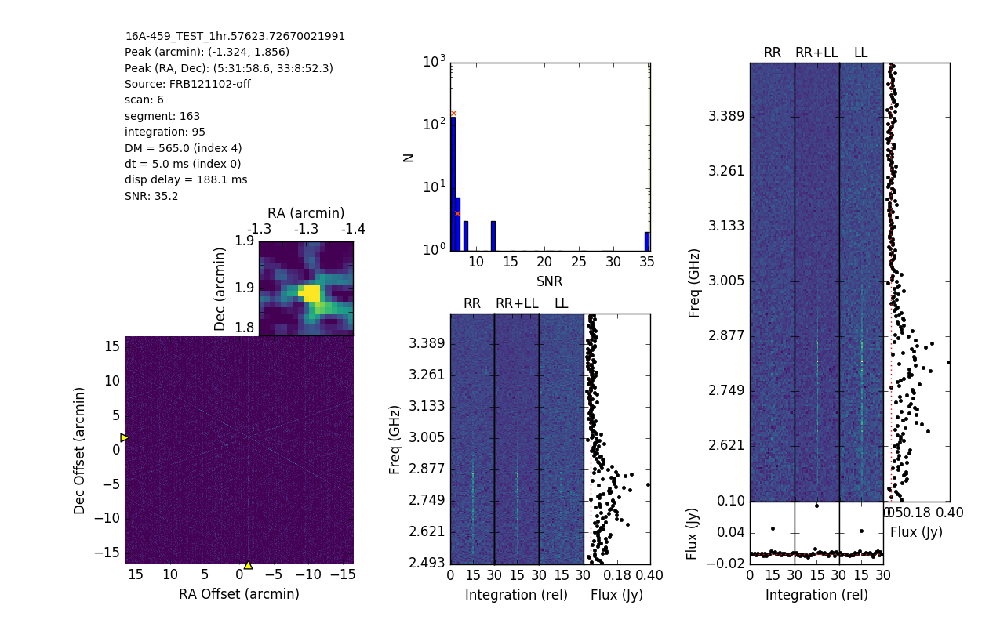

# The First Interferometric Detection of Fast Radio Burst FRB 121102

## Fast radio interferometric imaging with rtpipe

This repository contains computational (Jupyter) notebooks with reproduction analysis for the manuscript "The direct localization of a fast radio burst and its host" (http://dx.doi.org/10.1038/nature20797) and related publications. The associated data consist of visibilities and calibration files from the Very Large Array for nine radio bursts from the repeating Fast Radio Burst FRB 121102. The first burst captured, on 23 August 2016, is shown below.

The notebooks here present the latest snapshot of the analysis presented in and in support of our publications. They can be viewed with the Jupyter notebook viewer or directly on github. To reproduce (and improve!) the analysis, follow the steps below.

## Requirements

To reproduce the analysis, you need [rtpipe](https://github.com/caseyjlaw/rtpipe), a Python library for analyzing millisecond interferometric data (particularly from the [Very Large Array](https://science.nrao.edu/facilities/vla)). Instructions for installation are given on github, but in short you need:

- [Anaconda installer](https://www.continuum.io/downloads)
- Python 2.7
- [rtpipe](https://github.com/caseyjlaw/rtpipe) dependencies via anaconda
- `pip install rtpipe`

VLA visibility data for nine bursts from FRB 121102 are availble at the Harvard dataverse at http://dx.doi.org/10.7910/DVN/TLDKXG.

## Notebooks

- [demo_FRB121102.ipynb](https://github.com/caseyjlaw/FRB121102/blob/master/demo_FRB121102.ipynb) -- Demonstration of reading, preparing, finding and visualizing an FRB in a single FRB data file.
- [candidate_localization_casa.ipynb](https://github.com/caseyjlaw/FRB121102/blob/master/candidate_localization_casa.ipynb) -- Systematic analysis to localize the source of all nine bursts using [CASA](http://casa.nrao.edu).
- [candidate_sonification.ipynb](https://github.com/caseyjlaw/FRB121102/blob/master/candidate_sonification.ipynb) -- Convert dynamic spectra into sound files available at https://www.youtube.com/watch?v=i3x0sBCQ_c8.
